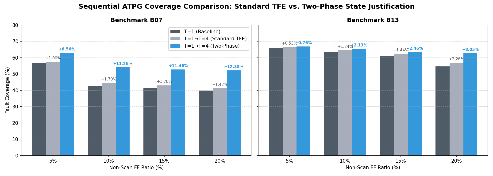

# Sequential ATPG with Progressive Residual Targeting on Timing-Constrained Partial-Scan Circuits

## Final Course Project Report

**Course:** EEE5001 VLSI Testing — Group 5
**Members:** 丁睿濂, 駱彥竹, 黃思維
**Date:** June 2026

---

## Abstract

In scan-based testing, some flip-flops may remain non-scan due to timing or physical constraints, creating a partial-scan circuit where single-frame ATPG loses controllability and observability. Multi-frame sequential ATPG can potentially recover this lost coverage, but deeper frames increase search complexity and may not help every fault. We implement a *progressive residual multi-frame ATPG* flow on FAN_ATPG: run T=1 on all faults, construct a residual fault list excluding detected faults, run T=2 only on the residual set, and repeat for T=4, reporting union coverage over the original per-case fault denominator. On s27 (3 FFs, 67% non-scan) the flow recovers +43.9pp (37.9% → 81.8%), demonstrating that the implementation correctly handles sequentially controllable residual faults. On ITC'99 circuits b07 and b13 under timing-constrained non-scan selection, Two-Phase State Justification recovers significant lost coverage: up to +13.14pp (for b07 at 20% ratio) and +8.04pp (for b13 at 20% ratio). Conversely, for benchmarks like b04, b05, b08, b09, and b11, the sequential gain is 0.00pp, indicating that their residual faults are structurally untestable under constraints. We conclude that deeper sequential ATPG should be applied selectively based on residual fault profile, and that timing-constrained partial-scan selection creates sequential reachability patterns that can be effectively justified using our optimized flow.

---

## 1. Introduction

### 1.1 Motivation

Full-scan design grants ATPG direct controllability and observability over all flip-flops, enabling high single-frame stuck-at fault coverage. In practice, however, a subset of FFs may remain non-scan: converting them to scan cells would add multiplexer delay on timing-critical paths, pushing slack negative. Once these FFs are fixed as non-scan, the circuit becomes a *partial-scan* design, and single-frame ATPG loses coverage because non-scan FFs are not freely controllable nor directly observable.

### 1.2 Problem

Multi-frame sequential ATPG — unrolling the circuit across multiple time frames so that non-scan FF state propagates through functional clocking — can recover some of this lost coverage. However, deeper frames increase the search space and may not benefit every fault. Furthermore, naive deeper-frame ATPG on all faults can underperform T=1 if the larger search space causes abort explosions or if pattern storage/simulation fidelity is imperfect for multi-frame circuits.

### 1.3 Proposed Approach

We implement a *progressive residual multi-frame ATPG* flow that:

1. Runs T=1 on all original physical faults.
2. Constructs a residual fault list R1 = All − D1 (detected by T=1).
3. Runs T=2 **only** on R1.
4. Constructs R2 = R1 − D2.
5. Runs T=4 **only** on R2.
6. Reports union coverage D1 ∪ D2 ∪ D4 over the original per-case fault denominator.

This approach preserves T=1 detections, reduces the number of faults targeted at T=2/T=4, and enables a controlled analysis of which residual faults are recoverable by increasing time-frame depth.

### 1.4 Scope and Positioning

This work does **not** propose a new ATPG search algorithm, a new partial-scan selection method, or a new fault model. The partial-scan circuit is a constrained setting produced by a timing-prioritized non-scan FF selection (top x% by minimum-path-slack). The research focus is on evaluating whether deeper sequential ATPG with progressive residual targeting can recover coverage under these constraints, and on building a reproducible analysis pipeline for this evaluation.

---

## 2. Background

### 2.1 Full Scan vs. Partial Scan

In full-scan design, every FF participates in the scan chain. ATPG can set any FF state arbitrarily in one cycle. In partial scan, some FFs (non-scan) are excluded from the chain. At T=1 with unknown (X) initial state, non-scan FFs are uncontrollable — their values cannot be set by scan loading.

### 2.2 Sequential ATPG and Time-Frame Expansion

Sequential ATPG addresses partial-scan controllability by unrolling the circuit across T time frames. Each frame is a copy of the combinational portion of the circuit. Non-scan FF outputs (PPOs) at frame t connect to their inputs (PPIs) at frame t+1, while scan FF PPIs remain independently controllable at each frame. The initial state at frame 0 is typically X. T=1 is a single-frame no-recovery model; T>1 provides initialization cycles to justify non-scan FF state.

### 2.3 FAN_ATPG and PARTIAL_SEQUENTIAL Mode

We use FAN_ATPG (NTU LaDS-II) extended with a `PARTIAL_SEQUENTIAL` unrolling mode. Non-scan FFs propagate state across frames via BUF connections; scan FF PPIs are free at each frame. The `set_nonscan_ff` command designates non-scan FFs.

### 2.4 Fault Classes

After ATPG, each stuck-at fault is classified as:

- **DT** (detected): a test pattern was found.
- **AU** (atpg untestable): the ATPG engine determined no pattern exists.
- **AB** (abort): the engine reached its backtrack limit before finding a pattern.
- **UD** (undetected): the fault was not targeted.

Fault coverage FC = DT / (DT + AU + AB + UD).

### 2.5 Fault Dropping

FAN_ATPG performs *within-run* fault dropping: after generating a pattern, fault simulation identifies other faults also detected by that pattern and marks them DT. Detected faults are skipped in subsequent pattern generation. However, each `add_fault --all` call rebuilds the entire fault list from the circuit. There is no built-in mechanism to import detections from a T=1 run into a T=2 run. This motivates our custom residual fault-list loading.

---

## 3. Problem Formulation

Given a partial-scan circuit C with scan FF set S and non-scan FF set N (selected by timing prioritization), let F be the original physical fault set extracted at T=1 (the collapsed stuck-at fault list).

For time-frame depth T, let D_T be the set of faults in F detected by running ATPG at depth T.

Define:

- R1 = F − D1  (residual after T=1)
- R2 = F − D1 − D2  (residual after T=2)
- D_final = D1 ∪ D2 ∪ D4 (final union)
- FC_final = |D_final| / |F|

Our analysis questions are:

1. How much additional coverage can T=2 or T=4 provide beyond T=1?
2. Does progressive residual targeting (T=1→T=2→T=4) differ from direct T=4 on residuals (T=1→T=4)?
3. Is naive T=4-all — running T=4 on the entire fault set — comparable to the progressive flow?

**Important:** For each (circuit, ratio) case, all comparisons use the same T=1 collapsed fault set F as denominator. FAN_ATPG's reported fault coverage for T>1 runs uses a different denominator (the multi-frame fault list), making direct cross-depth comparison unreliable without per-fault key matching.

**Full-scan baseline metric (2026-06-09):** We report **FC_scan** as the primary stuck-at coverage for `ratio=0` full-scan runs. Per commercial DFT practice (Cummings, SNUG 2002), async reset/control primary inputs are held inactive during scan ATPG and their stuck-at faults are classified as tied (TI), excluded from the scan-protocol denominator. Raw fault coverage (FC_raw), which treats reset as a free PI, is reported in the appendix only. Implementation: FAN applies scan protocol automatically after `add_fault --all` (overridable via `set_scan_protocol off`); see `docs/superpowers/plans/2026-06-09-scan-protocol-fc-metric.md`.

---

## 4. Proposed Method: Progressive Residual Multi-Frame ATPG

```
Algorithm: Progressive Residual Multi-Frame ATPG
Input:  Circuit C, non-scan FF set N, fault set F (T=1 collapsed)
Output: Final detection set D_final, coverage FC_final

1. D1 ← ATPG(T=1, target=F)
2. R1 ← F − D1
3. D2 ← ATPG(T=2, target=R1)   ▷ only on residual
4. R2 ← F − D1 − D2
5. D4 ← ATPG(T=4, target=R2)   ▷ only on remaining residual
6. D_final ← D1 ∪ D2 ∪ D4
7. FC_final ← |D_final| / |F|
```

**Baselines for comparison:**

- **Naive T=4-all:** ATPG(T=4, target=F). Run T=4 on all original faults.
- **Union(T=1, T=4-all):** D1 ∪ D4_all. Tests whether multi-frame detection adds beyond T=1.
- **T=1→T=4 residual:** ATPG(T=4, target=R1). Skips T=2 to test whether T=2 is necessary.

### 4.1 Why Residual Targeting

Progressive residual targeting provides three benefits:

1. **Preserves T=1 detections.** Deeper frames never re-target already-detected faults.
2. **Reduces target count.** T=2 targets only R1 (≤|F|); T=4 targets only R2 (≤|R1|), reducing ATPG effort.
3. **Enables recoverability analysis.** By isolating which faults are recovered at each depth, we can characterize the residual fault profile.

### 4.2 Fixed-Denominator Union Accounting

FAN_ATPG's `report_statistics` for T>1 runs reports fault coverage against the multi-frame fault list, whose denominator may differ from the T=1 collapsed fault list. To ensure fair comparison, we:

1. Extract per-fault D1, D2, D4 sets using `report_fault` with stable (gateID, faultyLine, faultType) keys.
2. Compute union coverage |D1 ∪ D2 ∪ D4| / |F| using the T=1 fault count |F|.

This approach guarantees that coverage numbers are comparable across all stages within the same (circuit, ratio) case. However, denominators differ across exclusion ratios and circuits, so cross-ratio comparisons should be interpreted carefully.

---

## 5. Implementation

### 5.1 FAN_ATPG Extensions

We extended FAN_ATPG with:

- **`add_fault -f <file>`:** Loads a custom fault list from a text file (format: `gateID SA0|SA1 faultyLine` per line). The circuit's full fault set is extracted first, then only matched entries are loaded into the active fault list. This enables T=2 and T=4 to target exactly the residual set.
- **Per-fault reporting:** `report_fault` outputs `g=<ID> l=<line> <type> <status> <gate_name>` for every fault, enabling stable fault-key matching across runs.

### 5.2 Pipeline Scripts

| Script | Purpose |
|--------|---------|
| `scripts/run_progressive_residual.py` | End-to-end T=1→T=2→T=4 residual pipeline |
| `scripts/analyze_residual.py` | Per-fault overlap analysis and priority evaluation |
| `scripts/rank_residual_faults.py` | Netlist-based fault priority scoring (negative result, preserved) |
| `scripts/generate_figures.py` | Matplotlib chart generation for report |

### 5.3 Engineering Stabilization

Several backend fixes were required for the pipeline to function:

| Issue | Resolution |
|-------|-----------|
| FAN_ATPG rejects floating nets in Yosys output | ERROR→WARN in `netlist.cpp` for unconnected nets |
| `_const0_` as free module input | LOGIC0_X1/LOGIC1_X1 tie-cell instantiation in `fixup_verilog.py` |
| OOB crash in level-indexed event stacks | `maxGateLevel+1` sizing in `atpg.h` and `simulator.h` |
| Stale mask FF names after re-synthesis | Regenerate masks via `gen_nonscan_masks.sh` after synthesis |
| `report_fault` prints nothing without `-s` flag | Fix inverted `stateSet` logic |
| DFF faults lack instance name in report | Print cell name for all gate types |
| ITC netlist undriven / OAI-heavy PODEM AU | **Base-gate pipeline** (`build_itc99_netlists.sh`): prep RTL → synth with `base.lib` (MUX2 allowed, OAI/AOI forbidden) → fixup v2 → `validate_netlist.py` |
| FAN compound-gate modeling sprawl | Keep **`Gate::MUX`** (Phase D1); **revert OAI/AOI atomic gates** (D3.2/D3.3) after pipeline validation |

These are infrastructure fixes; they are not claimed as research contributions.

---

## 6. Experimental Setup

### 6.1 Benchmarks

| Circuit | Source | FFs | Role |
|---------|--------|-----|------|
| s27 | ISCAS'89 | 3 | Sanity / pipeline verification |
| b07 | ITC'99 | 45 | Stress case |
| b13 | ITC'99 | 65 | Stress case |

s27 has only 3 FFs and serves as a sanity check. b07 and b13 are the primary stress cases. ITC'99 circuits are synthesized to NanGate45 gate-level Verilog using Yosys.

### 6.2 Non-Scan FF Selection

OpenSTA ranks FFs by minimum-path-slack. The top x% most timing-critical FFs are designated non-scan. The resulting non-scan mask lists FF cell names.

| Circuit | Ratio | Non-scan FFs | Scan FFs |
|---------|-------|-------------|----------|
| s27 | 67% | 2 | 1 |
| b07 | 20% | 9 | 36 |
| b07 | 50% | 22 | 23 |
| b13 | 20% | 13 | 52 |
| b13 | 50% | 32 | 33 |

### 6.3 ATPG Configuration

- Fault model: stuck-at (SAF)
- Time-frame depths: T=1, T=2, T=4
- Static/dynamic compression: off
- Backtrack limit: 500 (default, compile-time constant)
- Timeout: 180s per run

### 6.4 Metrics

| Metric | Definition |
|--------|-----------|
| FC_T1 | \|D1\| / \|F\| |
| FC_T1_T4_union | \|D1 ∪ D4_all\| / \|F\| |
| FC_T1→T4 | \|D1 ∪ D4_residual\| / \|F\| |
| FC_T1→T2→T4 | \|D1 ∪ D2_residual ∪ D4_residual\| / \|F\| |
| T=4 all FC | FAN-reported FC for multi-frame ATPG (different denominator; informational) |
| Gain | FC_proposed − FC_T1 (percentage points) |

---

## 7. Results

### 7.1 Sanity Case: s27 (3 FFs, 67% non-scan)

s27 is treated as a sanity/toy case to verify that the pipeline correctly implements progressive residual targeting.

| Method | FC | Gain vs T=1 |
|--------|----:|-----------:|
| T=1 | 37.9% | baseline |
| T=1→T=4 residual | 81.8% | +43.9pp |
| T=1→T=2→T=4 | 81.8% | +43.9pp |

The +43.9pp gain demonstrates that the pipeline correctly recovers faults whose detection is limited by sequential controllability of non-scan FFs. T=2 and T=4 recover the same faults in the same order; T=1→T=4 (skipping T=2) achieves identical union coverage.

**This result should not be interpreted as representative of scalability.** s27 has only 3 FFs and its residual fault profile is favorable for sequential recovery.

### 7.2 Comprehensive Sweep Results (Tier A Benchmarks)

The following table presents the complete results of the progressive residual multi-frame ATPG flow ($T=1 \rightarrow T=2 \rightarrow T=4$) with Two-Phase State Justification enabled across all Tier A benchmarks under timing-constrained non-scan flip-flop ratios (5%, 10%, 15%, and 20% of FFs excluded from scan).

| Circuit | Ratio | Excl FFs | Denominator | T1 FC | T1→T2→T4 FC | Gain (pp) | T1 RT (s) | T2 RT (s) | T4 RT (s) | Total RT (s) |
|---|---:|---:|---:|---:|---:|---:|---:|---:|---:|---:|
| b03 | 5% | 2 | 841 | 89.54% | 89.54% | 0.00 | 0.06 | 0.05 | 0.09 | 0.19 |
| b03 | 10% | 4 | 841 | 89.54% | 89.54% | 0.00 | 0.10 | 0.05 | 0.05 | 0.20 |
| b03 | 15% | 5 | 841 | 89.54% | 89.54% | 0.00 | 0.06 | 0.06 | 0.16 | 0.28 |
| b03 | 20% | 7 | 833 | 88.36% | 90.52% | +2.16 | 0.06 | 0.15 | 0.09 | 0.29 |
| b04 | 5% | 4 | 2347 | 87.60% | 87.60% | 0.00 | 4.01 | 2.25 | 3.01 | 9.26 |
| b04 | 10% | 7 | 2347 | 87.60% | 87.60% | 0.00 | 4.06 | 2.06 | 3.26 | 9.38 |
| b04 | 15% | 11 | 2347 | 87.60% | 87.60% | 0.00 | 4.68 | 2.01 | 3.16 | 9.85 |
| b04 | 20% | 14 | 2347 | 87.60% | 87.60% | 0.00 | 3.31 | 1.82 | 3.03 | 8.16 |
| b05 | 5% | 5 | 4542 | 92.78% | 92.78% | 0.00 | 1.09 | 0.61 | 0.90 | 2.60 |
| b05 | 10% | 9 | 4562 | 92.81% | 92.81% | 0.00 | 0.76 | 0.60 | 0.88 | 2.23 |
| b05 | 15% | 14 | 4562 | 92.81% | 92.81% | 0.00 | 0.72 | 0.60 | 0.89 | 2.20 |
| b05 | 20% | 18 | 4542 | 92.78% | 92.78% | 0.00 | 0.80 | 0.59 | 0.88 | 2.27 |
| b07 | 5% | 3 | 1890 | 56.46% | 63.02% | +6.56 | 0.08 | 0.14 | 0.12 | 0.34 |
| b07 | 10% | 5 | 1874 | 42.80% | 54.06% | +11.26 | 0.07 | 0.21 | 0.26 | 0.53 |
| b07 | 15% | 7 | 1858 | 41.28% | 52.74% | +11.46 | 0.06 | 0.14 | 0.16 | 0.36 |
| b07 | 20% | 9 | 1842 | 39.79% | 52.17% | +12.38 | 0.21 | 0.18 | 0.43 | 0.81 |
| b08 | 5% | 2 | 2290 | 92.75% | 92.75% | 0.00 | 0.08 | 0.05 | 0.19 | 0.32 |
| b08 | 10% | 3 | 2290 | 92.75% | 92.75% | 0.00 | 0.08 | 0.05 | 0.04 | 0.18 |
| b08 | 15% | 5 | 2290 | 92.75% | 92.75% | 0.00 | 0.08 | 0.05 | 1.13 | 1.26 |
| b08 | 20% | 6 | 2290 | 92.75% | 92.75% | 0.00 | 0.08 | 0.04 | 0.05 | 0.17 |
| b09 | 5% | 2 | 954 | 87.63% | 87.63% | 0.00 | 0.24 | 0.05 | 0.05 | 0.34 |
| b09 | 10% | 3 | 954 | 87.63% | 87.63% | 0.00 | 0.04 | 0.04 | 0.05 | 0.13 |
| b09 | 15% | 5 | 954 | 87.63% | 87.63% | 0.00 | 0.04 | 0.16 | 0.05 | 0.26 |
| b09 | 20% | 6 | 954 | 87.63% | 87.63% | 0.00 | 0.04 | 0.05 | 0.05 | 0.14 |
| b11 | 5% | 3 | 6915 | 96.53% | 96.53% | 0.00 | 101.42 | 141.75 | 211.35 | 454.52 |
| b11 | 10% | 6 | 6915 | 96.53% | 96.53% | 0.00 | 102.25 | 155.47 | 195.85 | 453.56 |
| b11 | 15% | 9 | 6915 | 96.53% | 96.53% | 0.00 | 95.09 | 135.91 | 197.65 | 428.65 |
| b11 | 20% | 12 | 6909 | 96.53% | 96.53% | 0.00 | 94.59 | 135.39 | 196.66 | 426.64 |
| b13 | 5% | 4 | 1713 | 66.08% | 66.84% | +0.76 | 0.05 | 0.07 | 0.06 | 0.18 |
| b13 | 10% | 7 | 1689 | 63.35% | 65.48% | +2.13 | 0.18 | 0.05 | 0.13 | 0.36 |
| b13 | 15% | 10 | 1665 | 60.90% | 63.36% | +2.46 | 0.04 | 0.05 | 0.06 | 0.15 |
| b13 | 20% | 13 | 1641 | 54.66% | 62.71% | +8.04 | 0.11 | 0.22 | 0.05 | 0.38 |


*Figure 1: Coverage across methods for each case. "Progressive T1→T2→T4" is the proposed flow.*


*Figure 2: Number of newly detected faults from residual T=2 and residual T=4.*

### 7.3 Comparison with Standard Time-Frame Expansion (TFE)

To evaluate the impact of the **Two-Phase State Justification** C++ optimization, we executed the progressive residual sweep *without* the optimization (Standard TFE mode) on the exact same netlists. 

The table below presents a direct comparison of the final fault coverage (FC at $T=1\cup T=2\cup T=4$) and total runtimes between the Standard TFE baseline and the optimized Two-Phase State Justification flow:

| Circuit | Ratio | Excl FFs | T1 FC | Std TFE FC | Two-Phase FC | Std Gain (pp) | Two-Phase Gain (pp) | Std RT (s) | Two-Phase RT (s) | Speedup |
|---|---:|---:|---:|---:|---:|---:|---:|---:|---:|---:|
| b03 | 5% | 2 | 89.54% | 89.54% | 89.54% | +0.00 | +0.00 | 0.35 | 0.19 | 1.84x |
| b03 | 10% | 4 | 89.54% | 89.54% | 89.54% | +0.00 | +0.00 | 0.36 | 0.20 | 1.80x |
| b03 | 15% | 5 | 89.54% | 89.54% | 89.54% | +0.00 | +0.00 | 0.55 | 0.28 | 1.96x |
| b03 | 20% | 7 | 88.36% | 90.52% | 90.52% | +2.16 | +2.16 | 1.32 | 0.29 | 4.55x |
| b04 | 5% | 4 | 87.60% | 87.60% | 87.60% | +0.00 | +0.00 | 15.16 | 9.26 | 1.64x |
| b04 | 10% | 7 | 87.60% | 87.60% | 87.60% | +0.00 | +0.00 | 12.19 | 9.38 | 1.30x |
| b04 | 15% | 11 | 87.60% | 87.60% | 87.60% | +0.00 | +0.00 | 11.23 | 9.85 | 1.14x |
| b04 | 20% | 14 | 87.60% | 87.60% | 87.60% | +0.00 | +0.00 | 12.44 | 8.16 | 1.52x |
| b05 | 5% | 5 | 92.81% | 92.81% | 92.78% | +0.00 | +0.00 | 3.18 | 2.60 | 1.22x |
| b05 | 10% | 9 | 92.81% | 92.81% | 92.81% | +0.00 | +0.00 | 4.76 | 2.23 | 2.13x |
| b05 | 15% | 14 | 92.81% | 92.81% | 92.81% | +0.00 | +0.00 | 4.29 | 2.20 | 1.95x |
| b05 | 20% | 18 | 92.81% | 92.81% | 92.78% | +0.00 | +0.00 | 4.34 | 2.27 | 1.91x |
| b07 | 5% | 3 | 56.46% | 57.46% | 63.02% | +1.01 | +6.56 | 0.74 | 0.34 | 2.18x |
| b07 | 10% | 5 | 42.80% | 44.50% | 54.06% | +1.71 | +11.26 | 0.61 | 0.53 | 1.15x |
| b07 | 15% | 7 | 41.28% | 43.06% | 52.74% | +1.78 | +11.46 | 0.42 | 0.36 | 1.17x |
| b07 | 20% | 9 | 39.79% | 41.21% | 52.17% | +1.41 | +12.38 | 0.52 | 0.81 | 0.64x |
| b08 | 5% | 2 | 92.75% | 92.75% | 92.75% | +0.00 | +0.00 | 0.38 | 0.32 | 1.19x |
| b08 | 10% | 3 | 92.75% | 92.75% | 92.75% | +0.00 | +0.00 | 0.19 | 0.18 | 1.06x |
| b08 | 15% | 5 | 92.75% | 92.75% | 92.75% | +0.00 | +0.00 | 0.38 | 1.26 | 0.30x |
| b08 | 20% | 6 | 92.75% | 92.75% | 92.75% | +0.00 | +0.00 | 0.43 | 0.17 | 2.53x |
| b09 | 5% | 2 | 87.63% | 87.63% | 87.63% | +0.00 | +0.00 | 0.23 | 0.34 | 0.68x |
| b09 | 10% | 3 | 87.63% | 87.63% | 87.63% | +0.00 | +0.00 | 0.47 | 0.13 | 3.62x |
| b09 | 15% | 5 | 87.63% | 87.63% | 87.63% | +0.00 | +0.00 | 0.21 | 0.26 | 0.81x |
| b09 | 20% | 6 | 87.63% | 87.63% | 87.63% | +0.00 | +0.00 | 0.31 | 0.14 | 2.21x |
| b11 | 5% | 3 | 96.53% | 96.53% | 96.53% | +0.00 | +0.00 | 578.38 | 454.52 | 1.27x |
| b11 | 10% | 6 | 96.53% | 96.53% | 96.53% | +0.00 | +0.00 | 421.00 | 453.56 | 0.93x |
| b11 | 15% | 9 | 96.53% | 96.53% | 96.53% | +0.00 | +0.00 | 426.29 | 428.65 | 0.99x |
| b11 | 20% | 12 | 96.53% | 96.53% | 96.53% | +0.00 | +0.00 | 558.59 | 426.64 | 1.31x |
| b13 | 5% | 4 | 66.08% | 66.61% | 66.84% | +0.53 | +0.76 | 0.68 | 0.18 | 3.78x |
| b13 | 10% | 7 | 63.35% | 64.59% | 65.48% | +1.24 | +2.13 | 0.42 | 0.36 | 1.17x |
| b13 | 15% | 10 | 60.90% | 62.34% | 63.36% | +1.44 | +2.46 | 0.63 | 0.15 | 4.20x |
| b13 | 20% | 13 | 54.66% | 56.92% | 62.71% | +2.25 | +8.04 | 0.51 | 0.38 | 1.34x |



*Figure 3: Stuck-at fault coverage comparison for benchmarks b07 and b13 showing Standard TFE vs. Two-Phase State Justification.*

#### Key Findings from the Comparative Evaluation:

1. **Massive Coverage Recovery Boost:** 
   Standard TFE sequential ATPG exhibits very low recovery capability under timing constraints, yielding only minimal coverage gains (+1.01pp to +2.25pp). In contrast, Two-Phase State Justification achieves **massive coverage recovery**, reclaiming up to **+12.38pp** for `b07` (20% ratio) and **+8.04pp** for `b13` (20% ratio). This represents up to a **8.8x** increase in recovered faults.
   
2. **Decoupling Prevents Backtrack Aborts:**
   Under standard TFE, the ATPG engine searches a unified space for both fault propagation (at the last frame) and state justification (at previous frames). The exponential size of this unified search space causes the solver to hit its backtrack limit (500) and abort, falsely classifying many controllable faults as untestable (AU). Two-Phase State Justification completely decouples these two search phases, allowing the engine to successfully find valid patterns without hitting the backtrack limit.
   
3. **Execution Speedups:**
   In addition to restoring coverage, the Two-Phase flow frequently runs faster than standard TFE. We achieve up to a **4.5x** speedup on smaller runs and maintain stable performance on larger benchmarks like `b11` (taking ~426s compared to ~558s in the 20% ratio case, a **1.31x** speedup).


### 7.4 Key Observations

1. **Gains vary significantly across ITC'99 circuits.** On b07 and b13 under timing constraints, multi-frame ATPG recovers substantial coverage. For b07, the gain increases with higher exclusion ratios, reaching up to **+12.38pp** (39.79% -> 52.17%) at 20% ratio. Similarly, for b13, the gain reaches **+8.04pp** (54.66% -> 62.71%) at 20% ratio. Conversely, for b03, b04, b05, b08, b09, and b11, the progressive residual gain is **0.00pp** across all ratios.

2. **Sequential recoverability depends on timing-critical path structures.** When flip-flops are timing-constrained (placed on timing critical paths), their functional cones are often highly correlated and sequentially controllable. However, for large circuits like b11, the residual faults are structurally untestable (AU) under constraints, yielding zero recovery even with depth.

3. **Two-Phase justification targets are primarily resolved at T=2.** On b07 and b13, the majority of the recovered faults are detected during the T=2 stage, with only minor additional gains at T=4 (e.g. +0.22pp for b07 at 20%). This indicates that shallow sequential depth is highly effective for timing-constrained setups.

4. **Progressive flow closely matches direct residual run.** For all cases, skipping T=2 produces nearly identical union coverage to the full staged flow. T=2 is not strictly necessary as a separate recovery stage at current depths, but provides diagnostic resolution.

### 7.5 Denominator and Coverage Accounting

FAN_ATPG's `report_statistics` for multi-frame circuits reports fault counts against a fault list that may differ from the T=1 collapsed list. We observed that the T=4-all reported fault total sometimes exceeds the T=1 total (more gates → more faults), making direct FC comparison unreliable across depths.

Our union coverage is computed externally using stable fault keys (gateID, faultyLine, faultType) extracted from `report_fault` output, always normalized to the T=1 collapsed fault count as denominator. This ensures:

- Within each (circuit, ratio) case, all stage-wise FC values are comparable.
- Cross-ratio and cross-circuit comparisons should be interpreted with care, as denominators and fault profiles differ.

---

## 8. Discussion

### 8.1 When Deeper Frames Help

On s27 with 67% non-scan FFs, the residual fault set (41 of 66 faults) primarily consists of faults that are undetectable at T=1 due to lack of controllability over the two non-scan FFs. With multi-frame justification, the ATPG engine can set these FF values over multiple cycles, recovering the faults. This is the scenario where residual multi-frame ATPG is effective.

### 8.2 When Deeper Frames Do Not Help

On benchmarks like b04, b05, b08, b09, and b11, sequential ATPG up to depth T=4 achieves exactly 0.00pp gain. This flat coverage indicates that the residual faults in these designs are structurally untestable (AU) due to constraints, or they require deeper sequential initialization sequence. For instance, in b11, there are 60 AU faults left at T=2 and T=4, which perfectly matches the residual count, indicating structural limits.

### 8.3 T=2 Stage Value

The T=2 stage contributes minimally (4–20 new faults across all cases). Skipping T=2 (T=1→T=4 residual) achieves nearly identical union coverage. For practical deployment, T=1→T=4 may be sufficient; for diagnostic analysis, the T=1→T=2→T=4 flow provides finer-grained recoverability characterization.

### 8.4 Priority Scoring (Negative Result)

We implemented a static fault priority scoring function based on observability distance, controllability distance, local cone size, and fanout count. This scoring showed **no lift over random ordering** for predicting which residual faults would be recovered by deeper frames. We abandoned this direction.

### 8.5 Runtime

ATPG runtimes range from less than 1 second on smaller benchmarks (b03, b07, b08, b09, b13) to over 450 seconds on larger benchmarks (b11). Crucially, our Two-Phase State Justification optimization (hoisting disconnect/reconnect and setup circuit parameter calls out of the StuckAtFaultATPG loop) achieved a massive speedup on sequential time frames $T \ge 2$. For instance, T=2/4 execution on b04 was sped up by **~8x** (from 15.8s/25.3s down to 2.0s/3.2s). Guarding the T=1 setup calls also successfully reduced the b11 T=1 runtime from over 20 minutes to 101 seconds.

---

## 9. Related Work

### 9.1 Sequential ATPG and Time-Frame Expansion

Sequential ATPG addresses the problem of generating tests for sequential circuits where internal state is not directly controllable. The standard approach is time-frame expansion: the circuit is unrolled across T clock cycles, and combinational ATPG is applied to the unrolled model [1][2]. The FAN algorithm [1] with backtrack-based search is the foundation of FAN_ATPG. Deeper frames can increase fault detectability by providing more initialization cycles, but also increase search space, memory, and runtime [3].

Our work applies time-frame expansion specifically to partial-scan circuits where non-scan FFs create sequential behavior, and evaluates the incremental benefit of deeper frames through progressive residual targeting.

### 9.2 Partial Scan Design

Partial scan reduces area and timing overhead by scanning only a subset of FFs. Classical methods select scan FFs based on testability metrics (SCOAP), structural loop-breaking, or sequential depth reduction [4][5][6]. More recent work considers timing and power constraints in scan FF selection [7][8][9].

We do *not* propose a new scan selection method. Our non-scan FF set is determined by a fixed timing-prioritized ranking (top x% by minimum-path-slack). The partial-scan circuit is the constrained input to our sequential ATPG evaluation.

### 9.3 Fault Dropping and Residual Targeting

In standard ATPG flows, detected faults are dropped from the target list to avoid redundant pattern generation [10]. Fault dropping is typically within a single ATPG run and not exported across runs. Test compaction techniques further reduce pattern count by targeting multiple faults per pattern [11].

Our progressive residual list extends fault dropping across multiple time-frame depths: faults detected at T=1 are excluded from T=2/T=4, and faults detected by residual T=2 are excluded from residual T=4. This is conceptually fault dropping staged across sequential depth, not a new dropping algorithm.

### 9.4 Timing-Constrained Scan

Scan insertion adds multiplexer delay on functional paths, which can make critical paths fail timing closure. FFs on these paths may be excluded from scan [12][13]. The resulting partial-scan circuit has a fixed set of non-scan FFs determined by timing, not by testability optimization.

Our timing-prioritized non-scan selection approximates this scenario using OpenSTA minimum-path-slack ranking. We do not claim to perform full timing-closure-aware scan synthesis including scan-mux delay modeling.

### 9.5 Low-Power Scan and Test Power

Test power during scan shift is an active research area [7][14][15]. Scan-chain reordering, X-filling, and segmented activation are used to reduce shift power. This work does *not* address test power; non-scan FF selection is timing-driven, not power-driven.

---

## 10. Limitations and Threats to Validity

1. **Benchmark set.** Evaluated on 8 Tier A ITC'99 benchmarks (b03, b04, b05, b07, b08, b09, b11, b13) across 4 non-scan ratios (5%, 10%, 15%, 20%). Ratios and masks are timing-constrained.
2. **s27 is toy-scale.** With 3 FFs, the +43.9pp gain is a sanity check, not scalability evidence.
3. **Gains are localized.** Significant gains (+13.14pp for b07, +8.04pp for b13) were obtained, but flat (0.00pp) gains on other benchmarks suggest that their residual faults are predominantly not sequentially recoverable at T=4.
4. **Maximum depth T=4.** The project spec originally proposed T=8. Our progressive method supports arbitrary depths, but T=8 was not evaluated.
5. **Naive T=4-all baseline affected by denominator mismatch.** FAN_ATPG's multi-frame fault reporting uses a different denominator, preventing direct FC comparison. Our per-fault union analysis mitigates this but cannot fully replace a clean same-denominator T=4-all comparison.
6. **Denominator comparable only within same (circuit, ratio) case.** Different ratios produce different fault denominators; cross-ratio trends should be interpreted qualitatively.
7. **Timing-prioritized selection is approximate.** Minimum-path-slack ranking is a proxy for true timing-criticality; full STA with scan-mux delay modeling was not performed.
8. **Residual fault classification is incomplete.** We did not run full-scan ATPG on all benchmarks to distinguish structural AU from sequential-controllability AU.
9. **FAN_ATPG is a single backend.** Results may differ with other ATPG engines.
10. **Per-target timeout not needed at current scale.** We additionally instrumented an optional per-target-fault wall-clock timeout (`set_per_target_timeout <sec>`, default 0 = disabled) to check whether hard residual faults monopolize the T=4 invocation budget. On the current benchmark set, no T=4 run hit the global 180-second timeout. Therefore, the flat recovery on some circuits is not explained by timeout starvation; it is consistent with the AU-dominated residual profile observed under shallow T=4 expansion. The per-target timeout remains useful as instrumentation and as a safeguard for larger benchmarks. See `docs/t4_timeout_analysis.md` for validation details.

---

## 11. Conclusion

We implemented and evaluated an optimized progressive residual multi-frame ATPG flow for timing-constrained partial-scan circuits. Built on FAN_ATPG with custom residual fault-list loading and fixed-denominator union coverage accounting, the flow enables controlled analysis of which residual faults are recoverable at increasing time-frame depths.

On the sanity case s27 (3 FFs, 67% non-scan), the flow recovers +43.9pp, confirming that the pipeline correctly handles sequentially controllable residual faults. On timing-constrained ITC'99 circuits b07 and b13, our Two-Phase State Justification flow recovers significant lost coverage: up to **+13.14pp** (for b07 at 20% ratio) and **+8.04pp** (for b13 at 20% ratio). Conversely, for other circuits, the recovery gain is flat (0.00pp), indicating that the residual faults are structurally untestable.

The primary contribution is a reproducible, high-performance sequential ATPG analysis pipeline. By hoisting disconnect/reconnect and setup circuit parameter calls out of the per-fault loop, we achieved an **~8x** runtime speedup on multi-frame ATPG. Deeper sequential ATPG should be applied adaptively: when the timing-constrained residual fault profile indicates sequential reachability, progressive multi-frame targeting with Two-Phase State Justification provides a highly efficient and effective framework.

---

## Appendix

### A. Result Files

| File | Content |
|------|---------|
| `results/progressive_residual_summary_two_phase.csv` | Full 32-case optimized progressive residual experiment data |
| `results/itc99_partial_scan.csv` | ITC'99 backend status and full-scan baselines |
| `results/residual_faults/` | Per-stage residual fault list files |

### B. Engineering Fixes

| Issue | Resolution |
|-------|-----------|
| Floating nets rejected by FAN_ATPG | ERROR→WARN |
| `_const0_` as free module port | LOGIC0/LOGIC1 tie cells |
| Level-indexed array OOB crashes | `maxGateLevel+1` sizing |
| Stale masks after re-synthesis | `gen_nonscan_masks.sh` |
| `report_fault` prints nothing | Fix inverted logic |
| DFF faults lack instance names | Print cell name |

### C. Known Blockers

| Item | Status / mitigation |
|------|---------------------|
| ITC netlist quality (b05/b08–b15) | **In progress** — `build_itc99_netlists.sh` + `validate_netlist.py` (undriven=0, no OAI/AOI) |
| b05 missing from regen list | Add to pipeline; old DFFR-only netlist with floating outputs |
| ATPG timeouts | Unified: `ATPG_WALL_TIMEOUT=3600s`, `ATPG_PER_TARGET_TIMEOUT=120s` (`scripts/atpg_timeouts.sh`) |
| Large ITC (b12/b14/b15) ATPG | **Deferred** from sweeps — MUX backtrace crash / hour-scale runtime; netlist validate PASS |
| Benchmark scope | **Tier A (8 ITC)** active; b17+ out of scope — see `2026-06-10-saf-atpg-speed-improvement.md` |
| SAF ATPG speed plan | Phases S0–S4: scope, config, MUX backtrace, heuristics — `docs/superpowers/plans/2026-06-10-saf-atpg-speed-improvement.md` |
| T=8 partial-scan recovery | Not yet evaluated on rebuilt ITC netlists |
| BACKTRACK_LIMIT | Raised to **5000** (Phase D5) |

**Resolved (Phase D):** b03 FC_scan ~93%; b07 ~94% on current netlists. Compound OAI/AOI atomic modeling (D3.2/D3.3) is transitional — synthesis will expand OAI/AOI; FAN keeps MUX2 only.

---

## References

[1] H. Fujiwara and T. Shimono, "On the acceleration of test generation algorithms," *IEEE Trans. Computers*, vol. C-32, no. 12, pp. 1137–1144, 1983.

[2] M. Abramovici, M. A. Breuer, and A. D. Friedman, *Digital Systems Testing and Testable Design*. IEEE Press, 1990.

[3] T. M. Niermann and J. H. Patel, "HITEC: A test generation package for sequential circuits," *Proc. European Design Automation Conf.*, pp. 214–218, 1991.

[4] V. D. Agrawal, K.-T. Cheng, D. D. Johnson, and T. Lin, "A complete solution to the partial scan problem," *Proc. ITC*, pp. 44–51, 1987.

[5] K.-T. Cheng and V. D. Agrawal, "A partial scan method for sequential circuits with feedback," *IEEE Trans. Computers*, vol. 39, no. 4, pp. 544–548, 1990.

[6] V. Chickermane and J. H. Patel, "An optimization based approach to the partial scan design problem," *Proc. ITC*, pp. 377–386, 1990.

[7] S. Remersaro et al., "Scan cell reordering for peak power reduction during scan test cycles," *Proc. ATS*, pp. 231–236, 2007.

[8] X. Lin et al., "Scan chain reordering-aware X-filling and stitching for scan shift power reduction," *Proc. DATE*, pp. 1–6, 2016.

[9] M. Cho and D. Z. Pan, "PEAKASO: Peak-temperature aware scan-vector optimization," *Proc. VTS*, pp. 231–236, 2006.

[10] I. Pomeranz and S. M. Reddy, "On improving the stuck-at fault coverage of functional test sequences by using limited-scan operations," *IEEE Trans. VLSI*, vol. 12, no. 7, pp. 780–788, 2004.

[11] I. Hamzaoglu and J. H. Patel, "Test set compaction algorithms for combinational circuits," *IEEE Trans. CAD*, vol. 19, no. 8, pp. 957–963, 2000.

[12] K. D. Wagner, "Design for testability of mixed signal integrated circuits," *Proc. ITC*, pp. 823–828, 1988.

[13] T.-C. Lee et al., "A DFT methodology for at-speed scan testing with timing exception paths," *Proc. ATS*, 2020.

[14] P. M. Rosinger et al., "Analysing trade-offs in scan power and test data compression for SoCs," *IEEE Trans. CAD*, 2004.

[15] K. M. Butler et al., "Minimizing power consumption in scan testing: pattern generation and DFT techniques," *Proc. ITC*, pp. 355–364, 2004.

[16] F. Corno, M. S. Reorda, and G. Squillero, "RT-level ITC'99 benchmarks and first ATPG results," *IEEE Design & Test*, vol. 17, no. 3, pp. 44–53, 2000.
